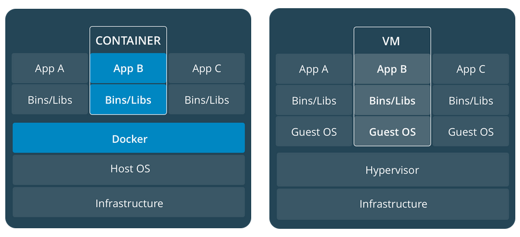

### Containers and virtual machines

A **container** runs _natively_ on Linux and shares the kernel of the host
machine with other containers. It runs a discrete process, taking no more memory
than any other executable, making it lightweight.

By contrast, a **virtual machine** (VM) runs a full-blown "guest" operating
system with _virtual_ access to host resources through a hypervisor. In general,
VMs provide an environment with more resources than most applications need.

